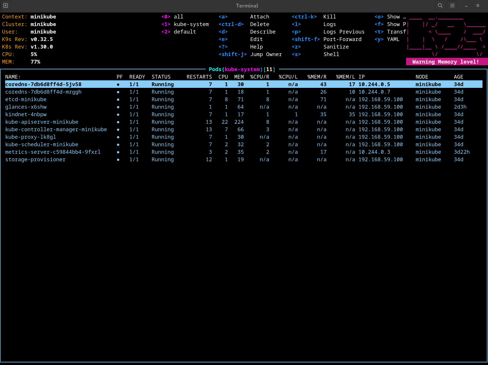
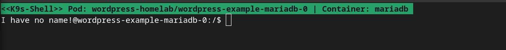
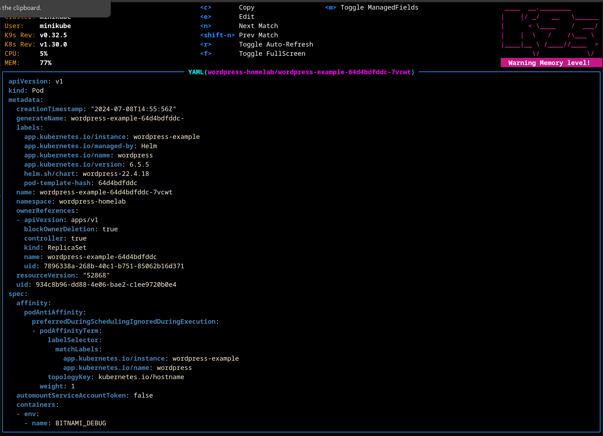

---
tags:
  - Kubernetes
---

# k9s - Un outil pratique 

Source : [k9s](https://github.com/derailed/k9s/)

**k9s** est une interface intérative intégré dans le shell pour observer et manipuler un cluster Kubernetes.

L'objetif principale ici est de simplifier la navigation au travers des objets dans Kubernetes et aussi de simplifier la manière dont on observer les évenements.

## Installation 

On télécharge le binaire depuis Github et on l'installe en fonction de notre plateforme

Debian :

```bash
sudo dpkg -i k9s_linux_amd64.deb
```

## Manipulation

Rien de plus simple, k9s se base sur le contexte courant, donc vous avez juste à lancer la commande **k9s**.

Cela nous donnes :



L'outils **k9s** est pratique dans le sens on l'on peut intéragir avec le Cluster directement.  Si on appuie sur la touche "**s**", on va alors demander un shell intéractif :



Ensuite, si l'on souhaite consulter le déploiement sur un pod particulier (dans mon cas, wordpress en Statefulset) :

