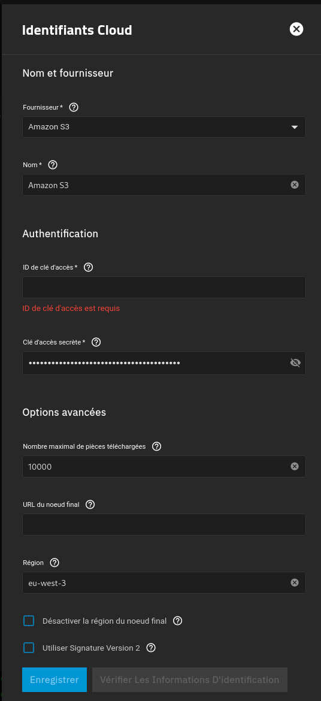
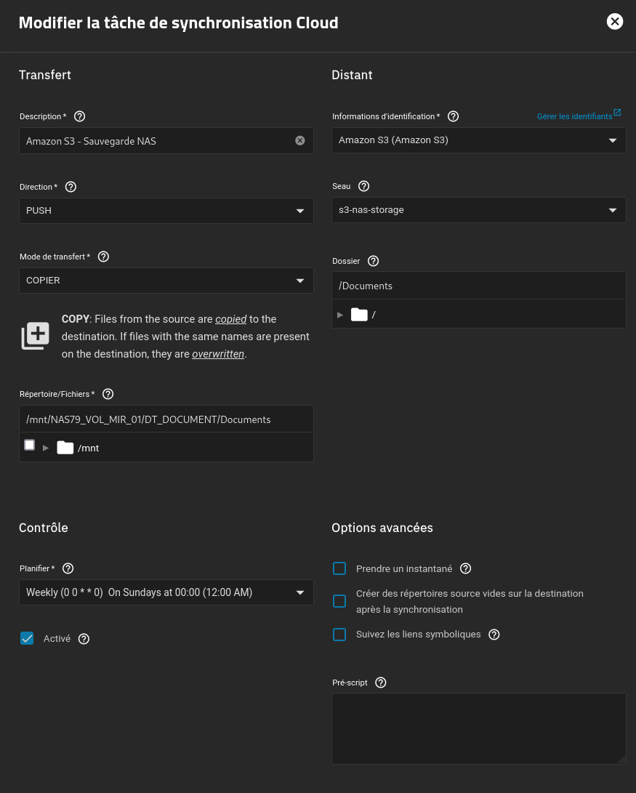

---
tags:
  - AWS
  - TrueNAS
---

# Sauvegarde via AWS !

Comment effectuer une sauvegarde sur un Stockage S3 sous AWS ?

Nous allons voir tout cela plus bas !

!!! warning "Requis"

    La création d'un compte AWS et de sa configuration ainsi que celle du stockage S3 ne sera pas traité dans cette partie.

## Identifiant Cloud AWS

Dans un premier temps, il faut créer un identifiant Cloud AWS dans TrueNAS.

Il faut se rendre dans l'onglet "**Identifians/Informations d'identification de sauvegarde"**, puis dans **Identifiants Cloud** :

Il faudra entrer les informations que vous aurez obtenu depuis AWS à la suite de la création d'un bucket S3 ainsi que d'un compte pour y accéder depuis l'extérieur.

## Configuration d'une sauvegarde

Rien de plus simple pour notre première sauvegarde dans le Cloud !

On se rend dans **Protection des données** puis on clique sur **Ajouter** sur le bloc **Tâches Sync Cloud** :

Fournisseur : **Amazon S3**

Ensuite on peut configurer la sauvegarde de plusieurs manières différentes, soit en mode *PUSH* (Envoi) ou alors en mode *PULL* (Récupération). Nous avons le choix sur le mode de transfert, on garde la source après copie vers la destination, ou alors on suprime sur la source et on garde uniquement la destination, etc...

Nous souhaitons ici copier des données sur notre NAS vers une source externe pour la protection en cas de perte.

Il suffit donc de configurer comme ci-dessous :

Vous pouvez choisir manuellement une planification. En fonction des données, il faut être vigilant, par exemple il ne faut pas envoyer un dossier contenant des films et qui pourrait grossir au fil du temps suivant vos ajouts personnels.

Dans mon cas, je régule mon dossier à être envoyé uniquement une fois par semaine.

!!! warning "Budget AWS S3"

    Le Stockage AWS S3 est payant à l'usage, c'est à dire que plus vous aurez d'espace de stockage utilisé ou même un grand nombre de requêtes, cela vous sera déduit chaque mois!
    Il est important de rester en maitrise de son stockage.