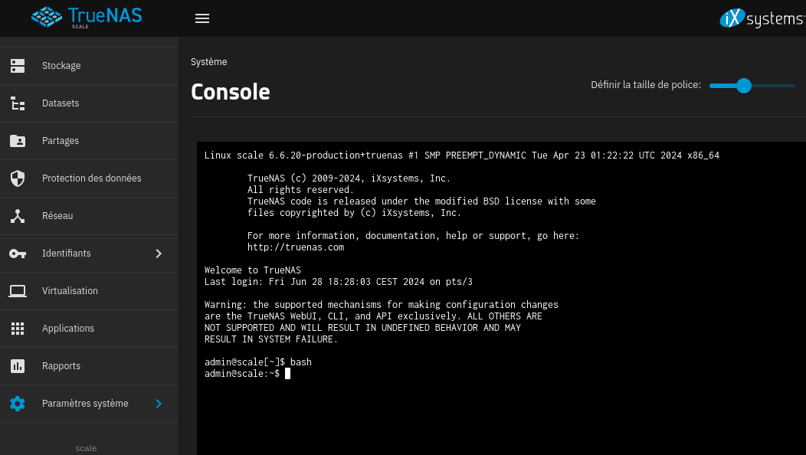
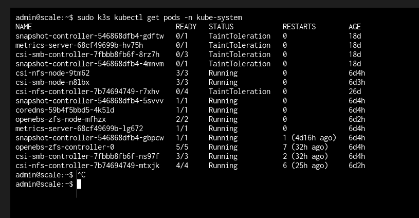

---
tags:
  - Kubernetes
  - TrueNAS
---

# Introduction

Ici, nous allons voir comment intéragir avec le cluster Kubernetes K3S auto-géré dans la solution NAS TrueNAS et sa variante Scale.

Notez que TrueNAS Core utilise encore des **jails** sous FreeBSD, c'est une sorte de "virtualisation/conteneur" à la mode **chroot**. Cette page ne sera donc utile si vous êtes sous **Core**.

## Accès à la ligne de commande

Pour ce faire, il y a deux moyens, le premier en passant par l'onglet **Console** sur l'interface Web ou le second en se connectant via ssh sur notre NAS.

Nous allons passer par la console dans cette partie :



Il faut se rendre dans **Paramètre système** puis **Console**.

Ensuite, rien de plus simple, on utilise le binaire **k3s** suivi de la commabde **kubectl** standard pour intéroger Kubernetes:

```bash
sudo k3s kubectl get pods -n kube-system
```

Tada !



